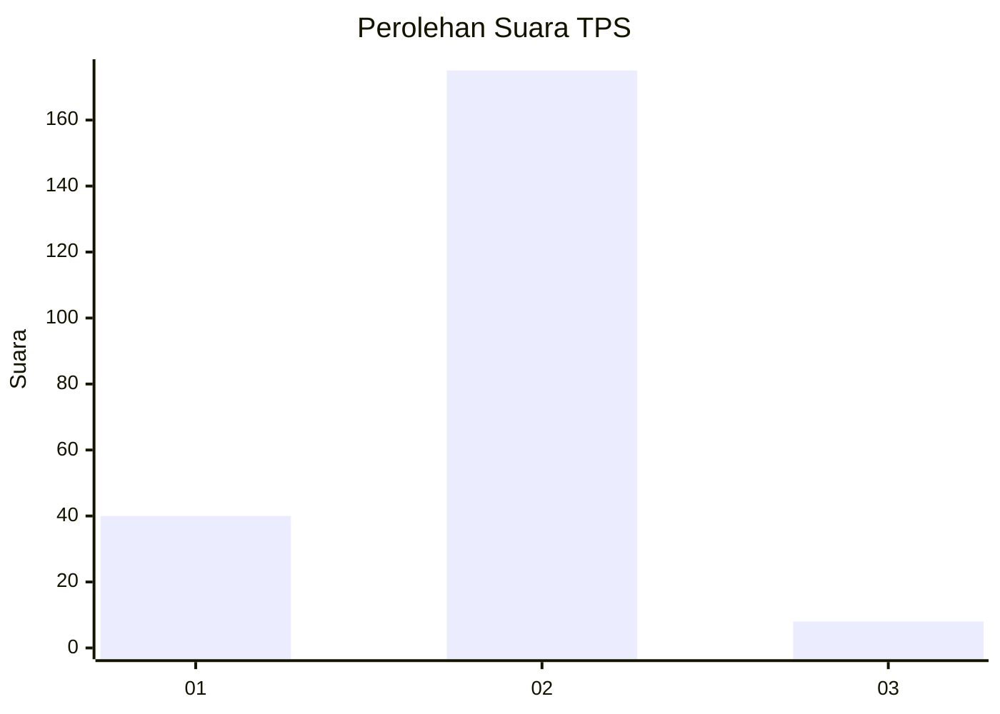
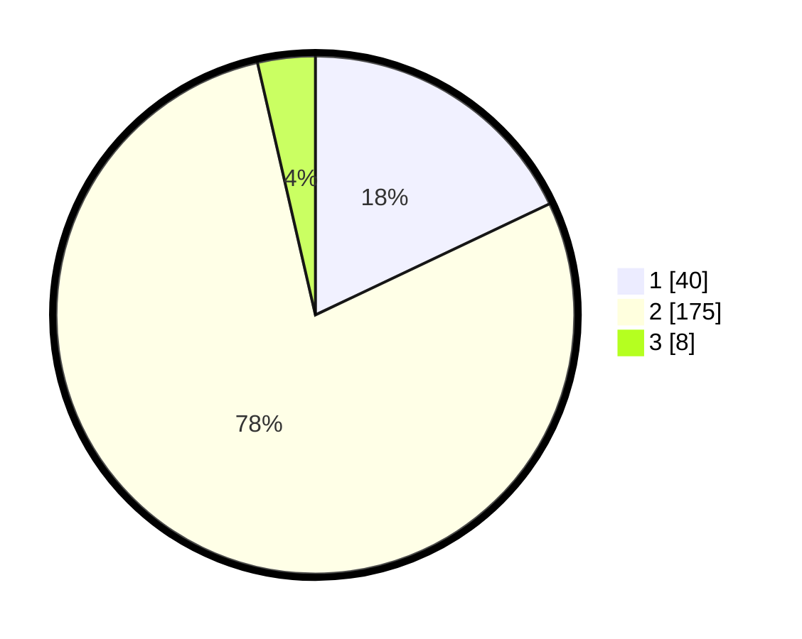

# Hasil

## Grafik

## Tabel

| No. | Nama Paslon    | Suara | Suara (raw) | Persentase |
|:--- |:-------------- | -----:| -----------:| ----------:|
| 1   | ANIES MUHAIMIN | 40    | [40][p-1]   | 17,94      |
| 2   | PRABOWO GIBRAN | 175   | [175][p-2]  | 78,48      |
| 3   | GANJAR MAHFUD  | 8     | [8][p-3]    | 3,59       |

[p-1]: https://github.com/gigit-pemilu/pemilu-2024-81-maluku/blob/main/pilpres/hitung-suara/sub/81-maluku/sub/71-kota-ambon/sub/04-teluk-ambon/sub/2002-poka/sub/004-tps/sub/paslon-1.txt
[p-2]: https://github.com/gigit-pemilu/pemilu-2024-81-maluku/blob/main/pilpres/hitung-suara/sub/81-maluku/sub/71-kota-ambon/sub/04-teluk-ambon/sub/2002-poka/sub/004-tps/sub/paslon-2.txt
[p-3]: https://github.com/gigit-pemilu/pemilu-2024-81-maluku/blob/main/pilpres/hitung-suara/sub/81-maluku/sub/71-kota-ambon/sub/04-teluk-ambon/sub/2002-poka/sub/004-tps/sub/paslon-3.txt

## Foto C Plano

https://sirekap-obj-formc.kpu.go.id/5626/pemilu/ppwp/81/71/04/20/02/8171042002004-20240217-204120--50224652-b17c-458f-8cb9-0dbd42e1bba9.jpg

https://sirekap-obj-formc.kpu.go.id/5626/pemilu/ppwp/81/71/04/20/02/8171042002004-20240217-204325--4abd88ab-0155-4c83-b4d2-a4d5b45ca18f.jpg

https://sirekap-obj-formc.kpu.go.id/5626/pemilu/ppwp/81/71/04/20/02/8171042002004-20240217-204430--ee7b1092-5033-41bd-ba8c-d677a9717ad5.jpg

## Metadata

| Key        | Value               |
| ---------- | ------------------- |
| Time Stamp | 2024-02-20 13:00:00 |

