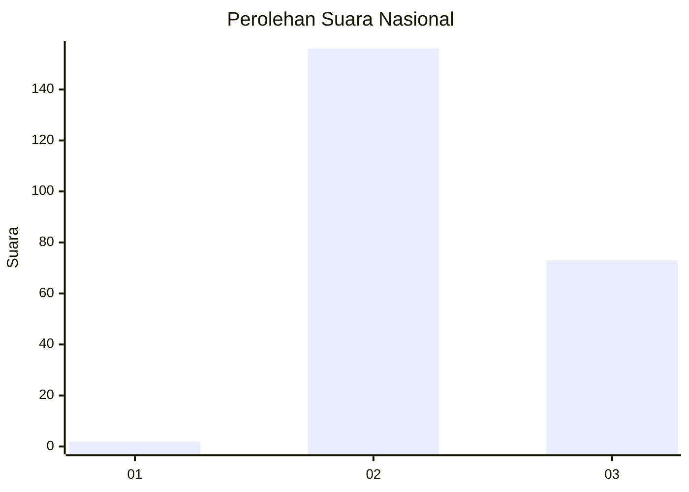
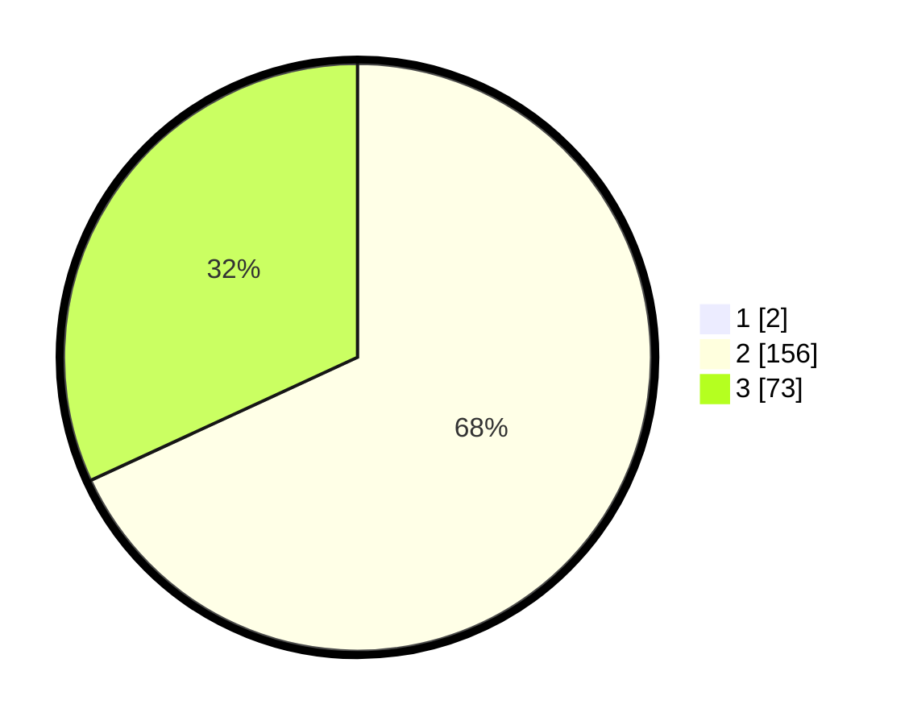

# Hasil

## Grafik

## Tabel

| No. | Nama Paslon    | Suara | Suara (raw) | Persentase |
|:--- |:-------------- | -----:| -----------:| ----------:|
| 1   | ANIES MUHAIMIN | 2     | [2][p-1]    | 0,87       |
| 2   | PRABOWO GIBRAN | 156   | [156][p-2]  | 67,53      |
| 3   | GANJAR MAHFUD  | 73    | [73][p-3]   | 31,60      |

[p-1]: https://github.com/gigit-pemilu/pemilu-2024/blob/main/pilpres/hitung-suara/sub/81-maluku/sub/71-kota-ambon/sub/05-leitimur-selatan/sub/2001-hukurila/sub/002-tps/sub/paslon-1.txt
[p-2]: https://github.com/gigit-pemilu/pemilu-2024/blob/main/pilpres/hitung-suara/sub/81-maluku/sub/71-kota-ambon/sub/05-leitimur-selatan/sub/2001-hukurila/sub/002-tps/sub/paslon-2.txt
[p-3]: https://github.com/gigit-pemilu/pemilu-2024/blob/main/pilpres/hitung-suara/sub/81-maluku/sub/71-kota-ambon/sub/05-leitimur-selatan/sub/2001-hukurila/sub/002-tps/sub/paslon-3.txt

## Foto C Plano

https://sirekap-obj-formc.kpu.go.id/66af/pemilu/ppwp/81/71/05/20/01/8171052001002-20240215-012557--0d227d95-f833-4fc0-8324-3c76e2aa982d.jpg

https://sirekap-obj-formc.kpu.go.id/66af/pemilu/ppwp/81/71/05/20/01/8171052001002-20240215-012644--f9223aa3-18cc-4d29-ba03-04dc104a809d.jpg

https://sirekap-obj-formc.kpu.go.id/66af/pemilu/ppwp/81/71/05/20/01/8171052001002-20240215-012753--104737f7-6e3a-47f3-9e81-dba87ba16832.jpg

## Metadata

| Key        | Value               |
| ---------- | ------------------- |
| Time Stamp | 2024-02-15 15:00:29 |

