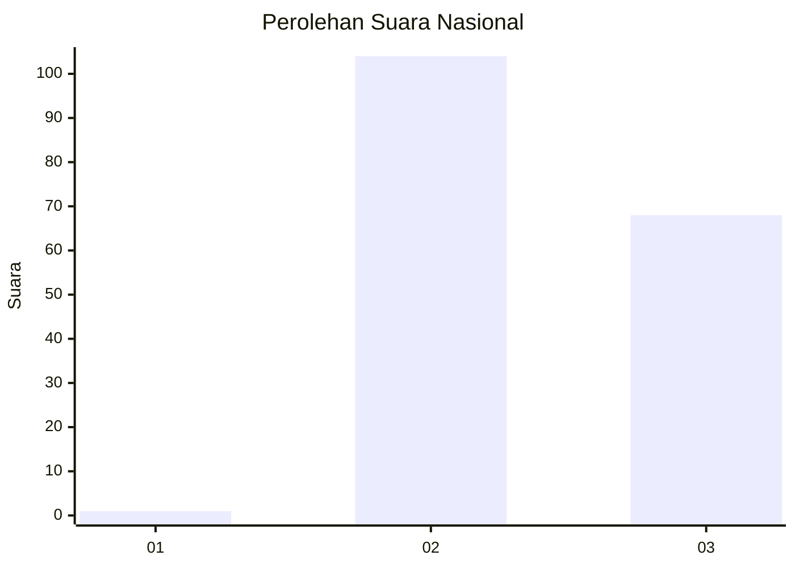
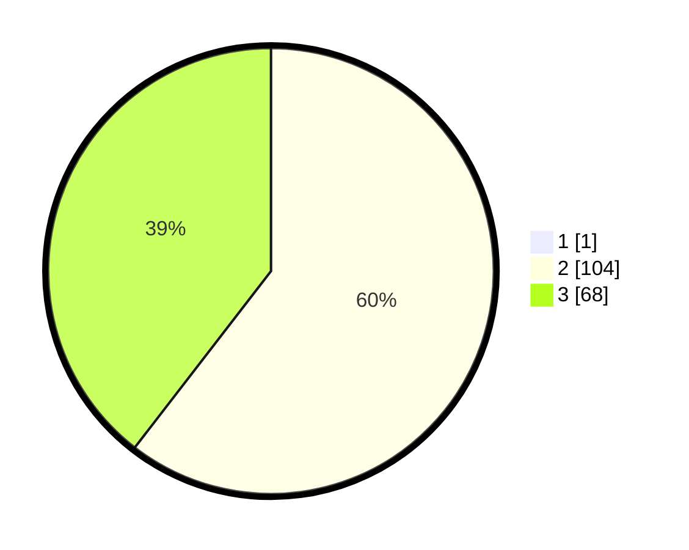

# Hasil

## Grafik

## Tabel

| No. | Nama Paslon    | Suara | Suara (raw) | Persentase |
|:--- |:-------------- | -----:| -----------:| ----------:|
| 1   | ANIES MUHAIMIN | 1     | [1][p-1]    | 0,58       |
| 2   | PRABOWO GIBRAN | 104   | [104][p-2]  | 60,12      |
| 3   | GANJAR MAHFUD  | 68    | [68][p-3]   | 39,31      |

[p-1]: https://github.com/gigit-pemilu/pemilu-2024/blob/main/pilpres/hitung-suara/sub/81-maluku/sub/71-kota-ambon/sub/05-leitimur-selatan/sub/2002-ema/sub/003-tps/sub/paslon-1.txt
[p-2]: https://github.com/gigit-pemilu/pemilu-2024/blob/main/pilpres/hitung-suara/sub/81-maluku/sub/71-kota-ambon/sub/05-leitimur-selatan/sub/2002-ema/sub/003-tps/sub/paslon-2.txt
[p-3]: https://github.com/gigit-pemilu/pemilu-2024/blob/main/pilpres/hitung-suara/sub/81-maluku/sub/71-kota-ambon/sub/05-leitimur-selatan/sub/2002-ema/sub/003-tps/sub/paslon-3.txt

## Foto C Plano

https://sirekap-obj-formc.kpu.go.id/ab63/pemilu/ppwp/81/71/05/20/02/8171052002003-20240214-203235--1199a658-f96f-4eea-b499-bf31be214c51.jpg

https://sirekap-obj-formc.kpu.go.id/ab63/pemilu/ppwp/81/71/05/20/02/8171052002003-20240214-213111--bf8dd614-2fec-4a0c-9bef-b03302e85e0d.jpg

https://sirekap-obj-formc.kpu.go.id/ab63/pemilu/ppwp/81/71/05/20/02/8171052002003-20240214-204033--98b05eaf-9b12-4bf4-a801-e42c0824098c.jpg

## Metadata

| Key        | Value               |
| ---------- | ------------------- |
| Time Stamp | 2024-02-15 15:00:29 |

