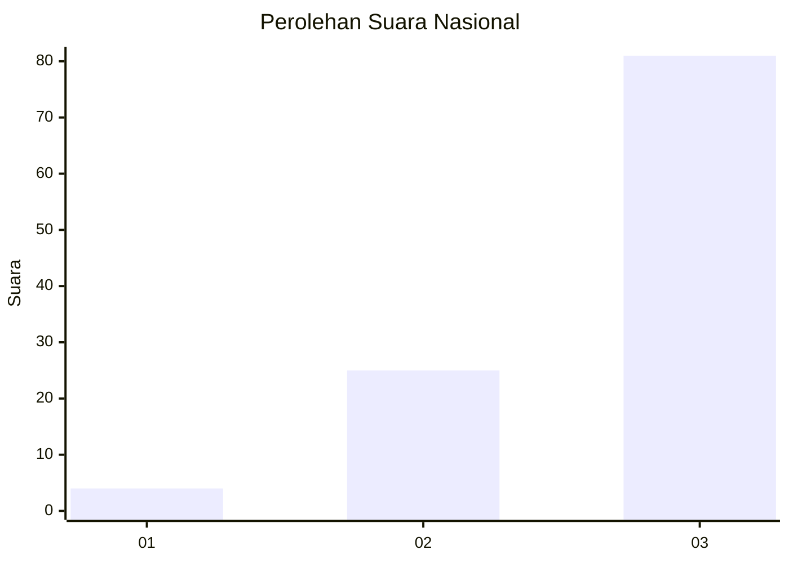
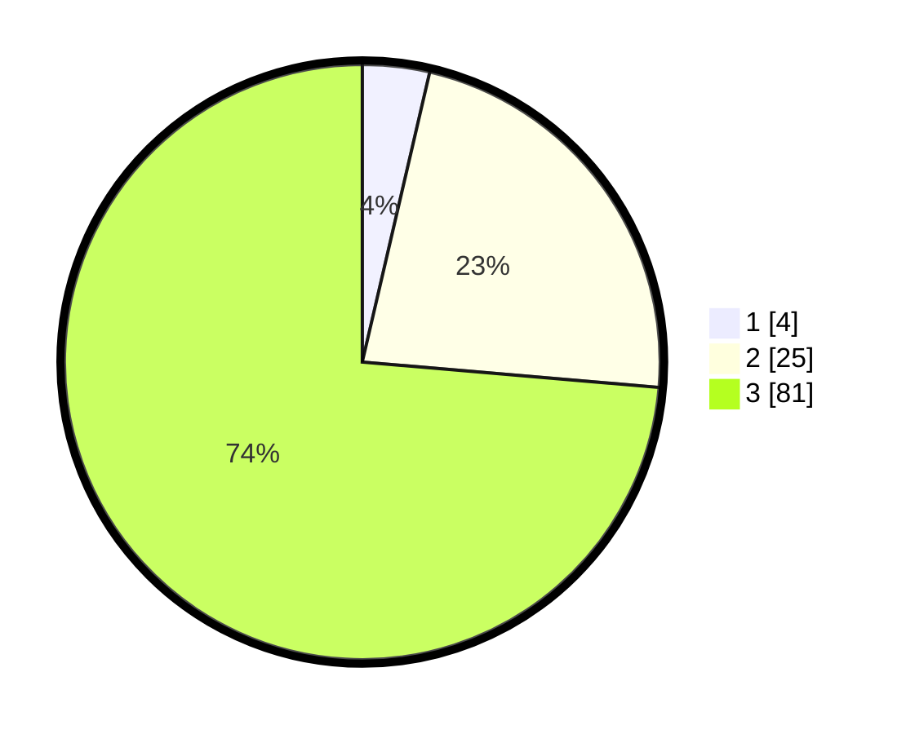

# Hasil

## Grafik

## Tabel

| No. | Nama Paslon    | Suara | Suara (raw) | Persentase |
|:--- |:-------------- | -----:| -----------:| ----------:|
| 1   | ANIES MUHAIMIN | 4     | [4][p-1]    | 3,64       |
| 2   | PRABOWO GIBRAN | 25    | [25][p-2]   | 22,73      |
| 3   | GANJAR MAHFUD  | 81    | [81][p-3]   | 73,64      |

[p-1]: https://github.com/gigit-pemilu/pemilu-2024/blob/main/pilpres/hitung-suara/sub/81-maluku/sub/71-kota-ambon/sub/05-leitimur-selatan/sub/2004-naku/sub/003-tps/sub/paslon-1.txt
[p-2]: https://github.com/gigit-pemilu/pemilu-2024/blob/main/pilpres/hitung-suara/sub/81-maluku/sub/71-kota-ambon/sub/05-leitimur-selatan/sub/2004-naku/sub/003-tps/sub/paslon-2.txt
[p-3]: https://github.com/gigit-pemilu/pemilu-2024/blob/main/pilpres/hitung-suara/sub/81-maluku/sub/71-kota-ambon/sub/05-leitimur-selatan/sub/2004-naku/sub/003-tps/sub/paslon-3.txt

## Foto C Plano

https://sirekap-obj-formc.kpu.go.id/dbde/pemilu/ppwp/81/71/05/20/04/8171052004003-20240215-005305--b3b5079b-bf4f-4f22-85d4-4d2eef023841.jpg

https://sirekap-obj-formc.kpu.go.id/dbde/pemilu/ppwp/81/71/05/20/04/8171052004003-20240215-010222--3796c264-ceef-4099-8633-d5609110f2ae.jpg

https://sirekap-obj-formc.kpu.go.id/dbde/pemilu/ppwp/81/71/05/20/04/8171052004003-20240215-010605--fa434b8d-4d6d-4883-b7af-afa2d4905188.jpg

## Metadata

| Key        | Value               |
| ---------- | ------------------- |
| Time Stamp | 2024-02-15 15:00:29 |

