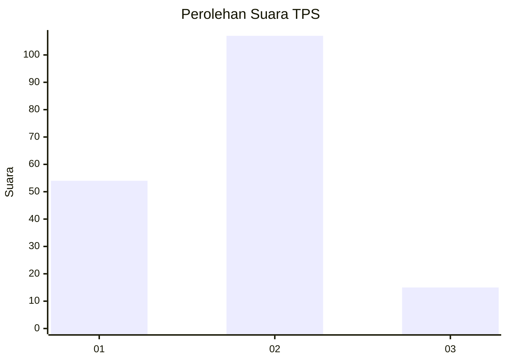
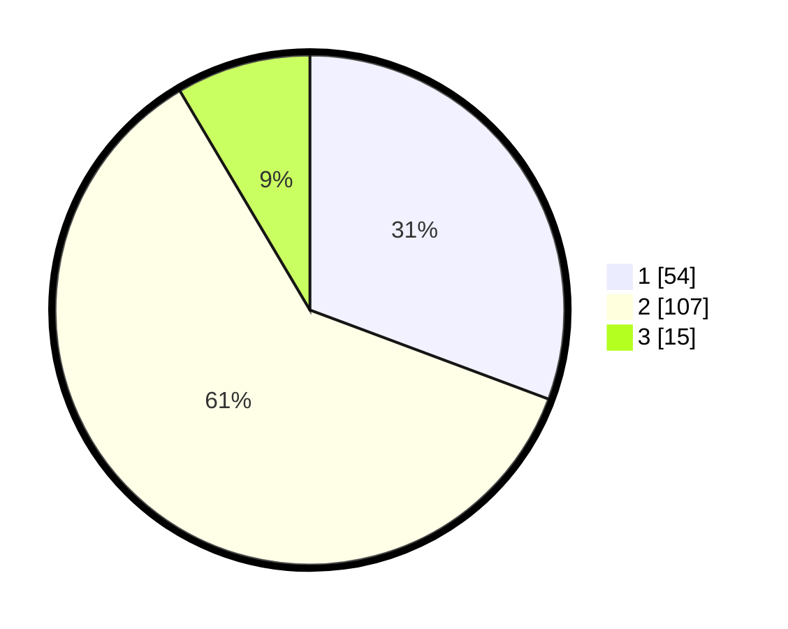

# Hasil

## Grafik

## Tabel

| No. | Nama Paslon    | Suara | Suara (raw) | Persentase |
|:--- |:-------------- | -----:| -----------:| ----------:|
| 1   | ANIES MUHAIMIN | 54    | [54][p-1]   | 30,68      |
| 2   | PRABOWO GIBRAN | 107   | [107][p-2]  | 60,80      |
| 3   | GANJAR MAHFUD  | 15    | [15][p-3]   | 8,52       |

[p-1]: https://github.com/gigit-pemilu/pemilu-2024-81-maluku/blob/main/pilpres/hitung-suara/sub/81-maluku/sub/72-kota-tual/sub/01-pulau-dullah-utara/sub/2001-fiditan/sub/001-tps/sub/paslon-1.txt
[p-2]: https://github.com/gigit-pemilu/pemilu-2024-81-maluku/blob/main/pilpres/hitung-suara/sub/81-maluku/sub/72-kota-tual/sub/01-pulau-dullah-utara/sub/2001-fiditan/sub/001-tps/sub/paslon-2.txt
[p-3]: https://github.com/gigit-pemilu/pemilu-2024-81-maluku/blob/main/pilpres/hitung-suara/sub/81-maluku/sub/72-kota-tual/sub/01-pulau-dullah-utara/sub/2001-fiditan/sub/001-tps/sub/paslon-3.txt

## Foto C Plano

https://sirekap-obj-formc.kpu.go.id/6487/pemilu/ppwp/81/72/01/20/01/8172012001001-20240215-184502--3e8157cf-aad5-42d6-a651-680aa8f75e72.jpg

https://sirekap-obj-formc.kpu.go.id/6487/pemilu/ppwp/81/72/01/20/01/8172012001001-20240215-142654--301cfce5-99e1-4f0d-b62d-5eca7011e08a.jpg

https://sirekap-obj-formc.kpu.go.id/6487/pemilu/ppwp/81/72/01/20/01/8172012001001-20240215-184625--cf27f402-b031-417e-a8b4-45545b296031.jpg

## Metadata

| Key        | Value               |
| ---------- | ------------------- |
| Time Stamp | 2024-02-16 16:25:10 |

