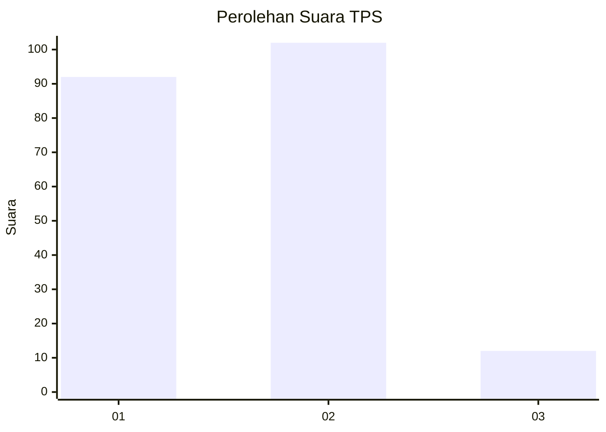
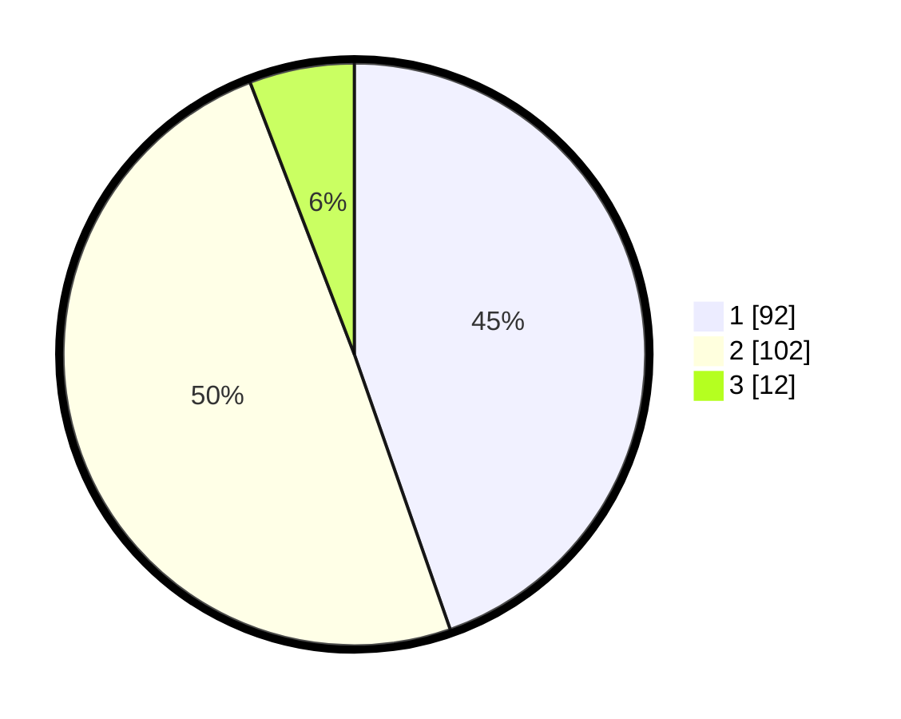

# Hasil

## Grafik

## Tabel

| No. | Nama Paslon    | Suara | Suara (raw) | Persentase |
|:--- |:-------------- | -----:| -----------:| ----------:|
| 1   | ANIES MUHAIMIN | 92    | [92][p-1]   | 44,66      |
| 2   | PRABOWO GIBRAN | 102   | [102][p-2]  | 49,51      |
| 3   | GANJAR MAHFUD  | 12    | [12][p-3]   | 5,83       |

[p-1]: https://github.com/gigit-pemilu/pemilu-2024-81-maluku/blob/main/pilpres/hitung-suara/sub/81-maluku/sub/72-kota-tual/sub/01-pulau-dullah-utara/sub/2001-fiditan/sub/003-tps/sub/paslon-1.txt
[p-2]: https://github.com/gigit-pemilu/pemilu-2024-81-maluku/blob/main/pilpres/hitung-suara/sub/81-maluku/sub/72-kota-tual/sub/01-pulau-dullah-utara/sub/2001-fiditan/sub/003-tps/sub/paslon-2.txt
[p-3]: https://github.com/gigit-pemilu/pemilu-2024-81-maluku/blob/main/pilpres/hitung-suara/sub/81-maluku/sub/72-kota-tual/sub/01-pulau-dullah-utara/sub/2001-fiditan/sub/003-tps/sub/paslon-3.txt

## Foto C Plano

https://sirekap-obj-formc.kpu.go.id/461b/pemilu/ppwp/81/72/01/20/01/8172012001003-20240215-152347--3437db33-f28c-42b5-aeef-86ef0d27ab89.jpg

https://sirekap-obj-formc.kpu.go.id/461b/pemilu/ppwp/81/72/01/20/01/8172012001003-20240215-151825--b3a60243-852d-4857-b51e-10bd5ed30941.jpg

https://sirekap-obj-formc.kpu.go.id/461b/pemilu/ppwp/81/72/01/20/01/8172012001003-20240215-152110--1af83943-cada-449b-a68e-76d7848cd699.jpg

## Metadata

| Key        | Value               |
| ---------- | ------------------- |
| Time Stamp | 2024-02-22 11:00:00 |

## DATA PEMILIH TETAP

Jumlah pemilih dalam DPT: **244**.
 * L: **119**.
 * P: **125**.

## DATA PENGGUNA HAK PILIH

Jumlah pengguna hak pilih dalam DPT: **99**.
 * L: **189**.
 * P: **90**.

Jumlah pengguna hak pilih dalam DPTb: **2**.
 * L: **4**.
 * P: **2**.

Jumlah pengguna hak pilih dalam DPK: **11**.
 * L: **85**.
 * P: **4**.

Jumlah pengguna hak pilih: **203**.
 * L: **111**.
 * P: **94**.

## JUMLAH SUARA SAH DAN TIDAK SAH

JUMLAH SELURUH SUARA SAH: **206**.

JUMLAH SUARA TIDAK SAH: **2**.

JUMLAH SELURUH SUARA SAH DAN SUARA TIDAK SAH: **208**.

