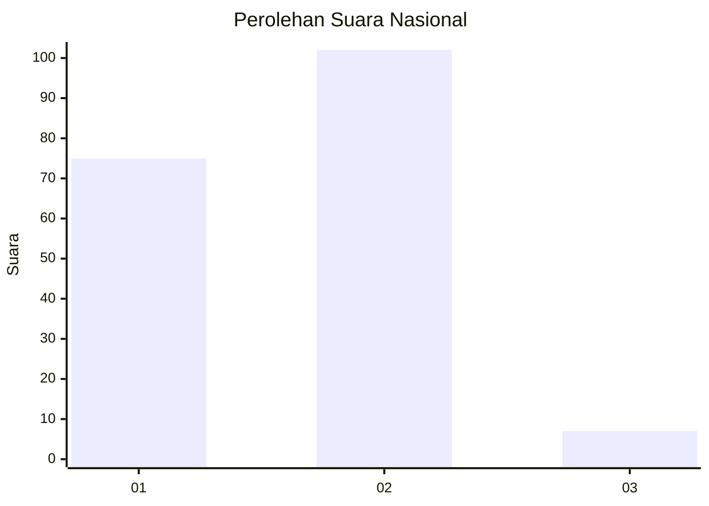
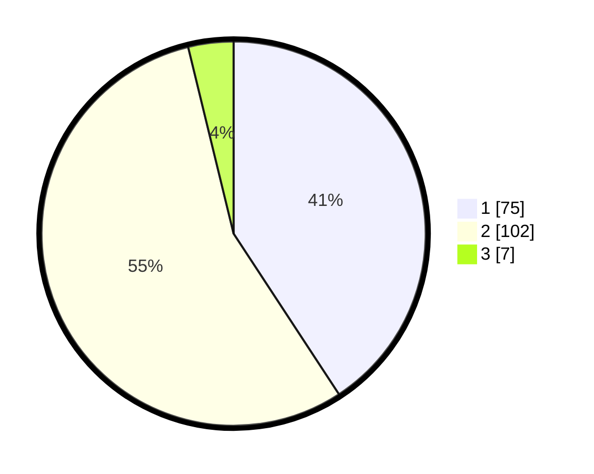

# Hasil

## Grafik

## Tabel

| No. | Nama Paslon    | Suara | Suara (raw) | Persentase |
|:--- |:-------------- | -----:| -----------:| ----------:|
| 1   | ANIES MUHAIMIN | 75    | [75][p-1]   | 40,76      |
| 2   | PRABOWO GIBRAN | 102   | [102][p-2]  | 55,43      |
| 3   | GANJAR MAHFUD  | 7     | [7][p-3]    | 3,80       |

[p-1]: https://github.com/gigit-pemilu/pemilu-2024/blob/main/pilpres/hitung-suara/sub/81-maluku/sub/72-kota-tual/sub/01-pulau-dullah-utara/sub/2001-fiditan/sub/004-tps/sub/paslon-1.txt
[p-2]: https://github.com/gigit-pemilu/pemilu-2024/blob/main/pilpres/hitung-suara/sub/81-maluku/sub/72-kota-tual/sub/01-pulau-dullah-utara/sub/2001-fiditan/sub/004-tps/sub/paslon-2.txt
[p-3]: https://github.com/gigit-pemilu/pemilu-2024/blob/main/pilpres/hitung-suara/sub/81-maluku/sub/72-kota-tual/sub/01-pulau-dullah-utara/sub/2001-fiditan/sub/004-tps/sub/paslon-3.txt

## Foto C Plano

https://sirekap-obj-formc.kpu.go.id/f746/pemilu/ppwp/81/72/01/20/01/8172012001004-20240215-190523--46c9c7a2-7deb-44ef-a927-53496f224025.jpg

https://sirekap-obj-formc.kpu.go.id/f746/pemilu/ppwp/81/72/01/20/01/8172012001004-20240215-191029--030bb2bc-59f0-4155-8cbd-add14248f074.jpg

https://sirekap-obj-formc.kpu.go.id/f746/pemilu/ppwp/81/72/01/20/01/8172012001004-20240215-191648--55c029ce-dce5-4562-8e58-a0df464e45ef.jpg

## Metadata

| Key        | Value               |
| ---------- | ------------------- |
| Time Stamp | 2024-02-25 12:00:00 |

