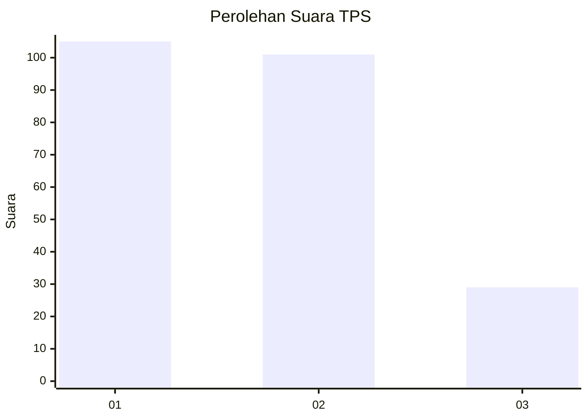
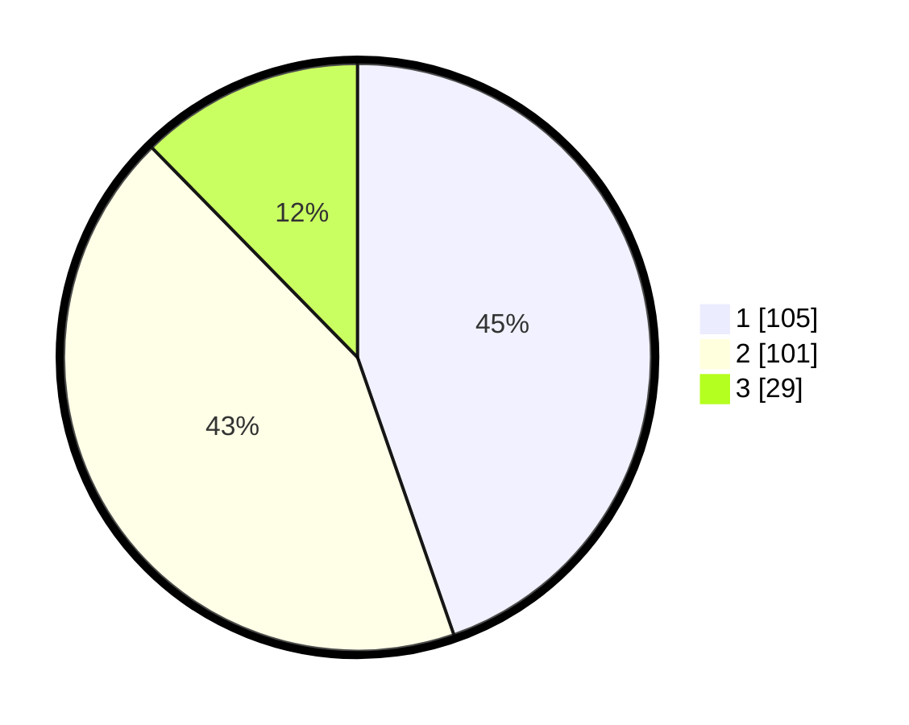

# Hasil

## Grafik

## Tabel

| No. | Nama Paslon    | Suara | Suara (raw) | Persentase |
|:--- |:-------------- | -----:| -----------:| ----------:|
| 1   | ANIES MUHAIMIN | 105   | [105][p-1]  | 44,68      |
| 2   | PRABOWO GIBRAN | 101   | [101][p-2]  | 42,98      |
| 3   | GANJAR MAHFUD  | 29    | [29][p-3]   | 12,34      |

[p-1]: https://github.com/gigit-pemilu/pemilu-2024-81-maluku/blob/main/pilpres/hitung-suara/sub/81-maluku/sub/72-kota-tual/sub/01-pulau-dullah-utara/sub/2001-fiditan/sub/005-tps/sub/paslon-1.txt
[p-2]: https://github.com/gigit-pemilu/pemilu-2024-81-maluku/blob/main/pilpres/hitung-suara/sub/81-maluku/sub/72-kota-tual/sub/01-pulau-dullah-utara/sub/2001-fiditan/sub/005-tps/sub/paslon-2.txt
[p-3]: https://github.com/gigit-pemilu/pemilu-2024-81-maluku/blob/main/pilpres/hitung-suara/sub/81-maluku/sub/72-kota-tual/sub/01-pulau-dullah-utara/sub/2001-fiditan/sub/005-tps/sub/paslon-3.txt

## Foto C Plano

https://sirekap-obj-formc.kpu.go.id/e152/pemilu/ppwp/81/72/01/20/01/8172012001005-20240215-152603--8fdc4e6b-d4db-4857-9004-4347c22f589e.jpg

https://sirekap-obj-formc.kpu.go.id/e152/pemilu/ppwp/81/72/01/20/01/8172012001005-20240215-152736--6ee18d02-d704-4395-94fe-7ef0ea97a512.jpg

https://sirekap-obj-formc.kpu.go.id/e152/pemilu/ppwp/81/72/01/20/01/8172012001005-20240215-153111--048755ec-0541-4ebd-b69b-3c5795520a56.jpg

## Metadata

| Key        | Value               |
| ---------- | ------------------- |
| Time Stamp | 2024-02-25 13:00:00 |

