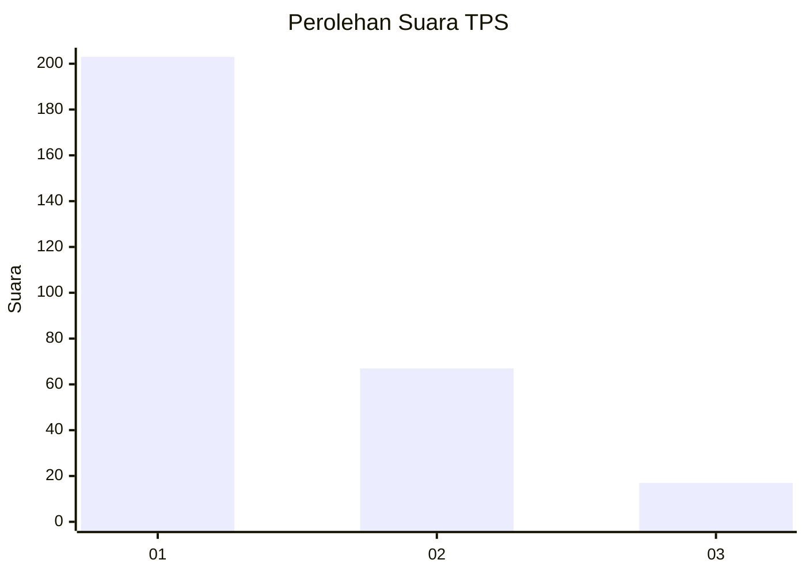
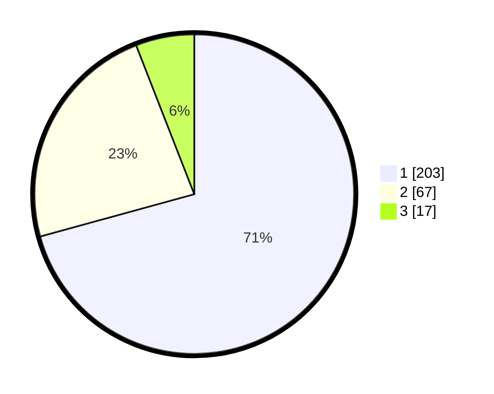

# Hasil

## Grafik

## Tabel

| No. | Nama Paslon    | Suara | Suara (raw) | Persentase |
|:--- |:-------------- | -----:| -----------:| ----------:|
| 1   | ANIES MUHAIMIN | 203   | [203][p-1]  | 70,73      |
| 2   | PRABOWO GIBRAN | 67    | [67][p-2]   | 23,34      |
| 3   | GANJAR MAHFUD  | 17    | [17][p-3]   | 5,92       |

[p-1]: https://github.com/gigit-pemilu/pemilu-2024-81-maluku/blob/main/pilpres/hitung-suara/sub/81-maluku/sub/72-kota-tual/sub/02-pulau-dullah-selatan/sub/1003-ketsoblak/sub/004-tps/sub/paslon-1.txt
[p-2]: https://github.com/gigit-pemilu/pemilu-2024-81-maluku/blob/main/pilpres/hitung-suara/sub/81-maluku/sub/72-kota-tual/sub/02-pulau-dullah-selatan/sub/1003-ketsoblak/sub/004-tps/sub/paslon-2.txt
[p-3]: https://github.com/gigit-pemilu/pemilu-2024-81-maluku/blob/main/pilpres/hitung-suara/sub/81-maluku/sub/72-kota-tual/sub/02-pulau-dullah-selatan/sub/1003-ketsoblak/sub/004-tps/sub/paslon-3.txt

## Foto C Plano

https://sirekap-obj-formc.kpu.go.id/cce5/pemilu/ppwp/81/72/02/10/03/8172021003004-20240215-215703--5b35129b-5d3a-47c1-8274-a89774051ec5.jpg

https://sirekap-obj-formc.kpu.go.id/cce5/pemilu/ppwp/81/72/02/10/03/8172021003004-20240215-215831--06e31fb3-2d4e-42a8-bee8-a0af9be75987.jpg

https://sirekap-obj-formc.kpu.go.id/cce5/pemilu/ppwp/81/72/02/10/03/8172021003004-20240215-215842--77c4a912-e130-4f47-a605-02571572c2b7.jpg

## Metadata

| Key        | Value               |
| ---------- | ------------------- |
| Time Stamp | 2024-02-24 23:00:00 |

