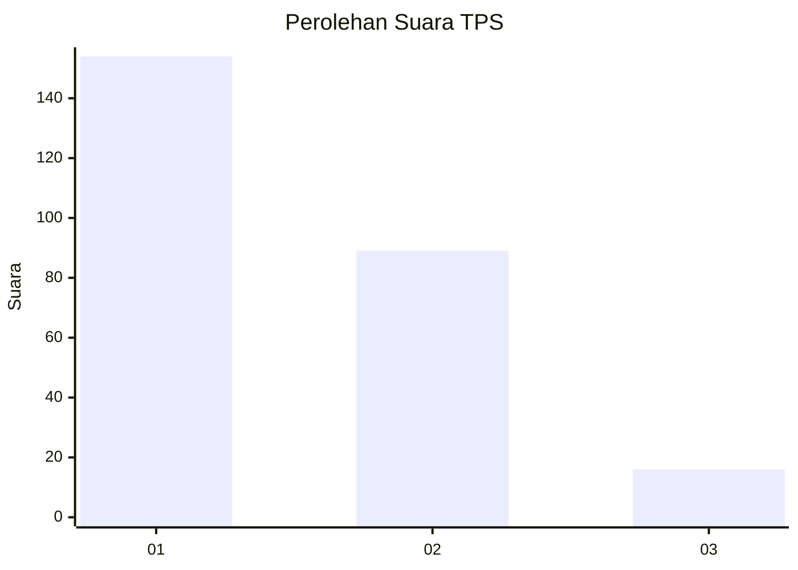
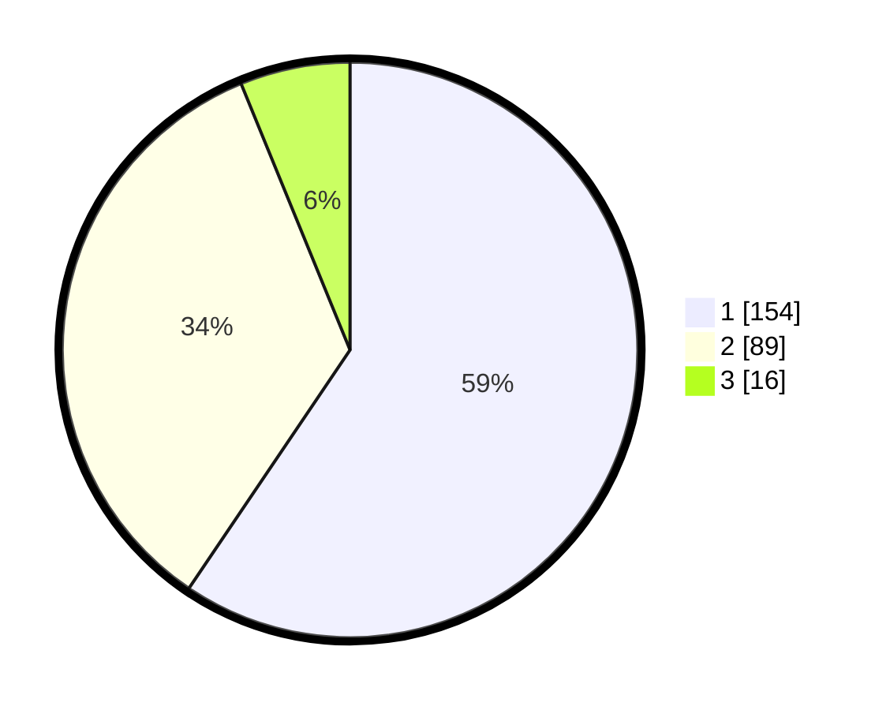

# Hasil

## Grafik

## Tabel

| No. | Nama Paslon    | Suara | Suara (raw) | Persentase |
|:--- |:-------------- | -----:| -----------:| ----------:|
| 1   | ANIES MUHAIMIN | 154   | [154][p-1]  | 59,46      |
| 2   | PRABOWO GIBRAN | 89    | [89][p-2]   | 34,36      |
| 3   | GANJAR MAHFUD  | 16    | [16][p-3]   | 6,18       |

[p-1]: https://github.com/gigit-pemilu/pemilu-2024-81-maluku/blob/main/pilpres/hitung-suara/sub/81-maluku/sub/72-kota-tual/sub/02-pulau-dullah-selatan/sub/1003-ketsoblak/sub/005-tps/sub/paslon-1.txt
[p-2]: https://github.com/gigit-pemilu/pemilu-2024-81-maluku/blob/main/pilpres/hitung-suara/sub/81-maluku/sub/72-kota-tual/sub/02-pulau-dullah-selatan/sub/1003-ketsoblak/sub/005-tps/sub/paslon-2.txt
[p-3]: https://github.com/gigit-pemilu/pemilu-2024-81-maluku/blob/main/pilpres/hitung-suara/sub/81-maluku/sub/72-kota-tual/sub/02-pulau-dullah-selatan/sub/1003-ketsoblak/sub/005-tps/sub/paslon-3.txt

## Foto C Plano

https://sirekap-obj-formc.kpu.go.id/f7dd/pemilu/ppwp/81/72/02/10/03/8172021003005-20240215-135734--53bbe903-8ee9-4ac4-99b5-09e56c850fe2.jpg

https://sirekap-obj-formc.kpu.go.id/f7dd/pemilu/ppwp/81/72/02/10/03/8172021003005-20240215-135515--0d1631a1-e161-4ca0-b34d-e035c09a4588.jpg

https://sirekap-obj-formc.kpu.go.id/f7dd/pemilu/ppwp/81/72/02/10/03/8172021003005-20240215-135952--8a48b0d5-1311-4f14-850b-9a4281ceb835.jpg

## Metadata

| Key        | Value               |
| ---------- | ------------------- |
| Time Stamp | 2024-02-25 16:00:00 |

