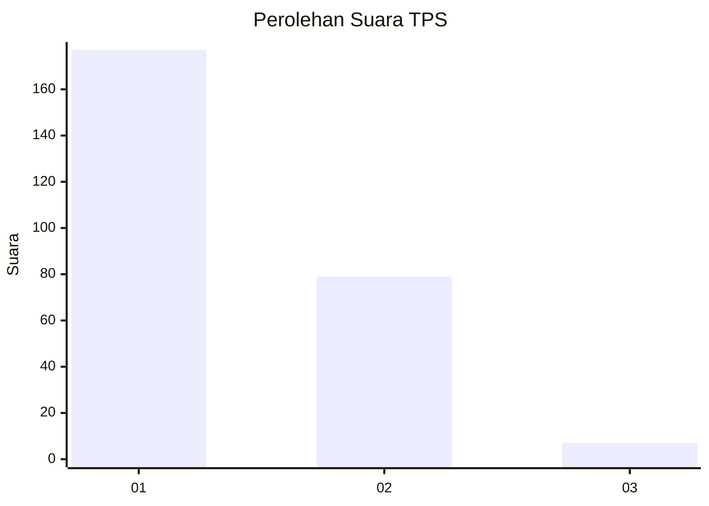
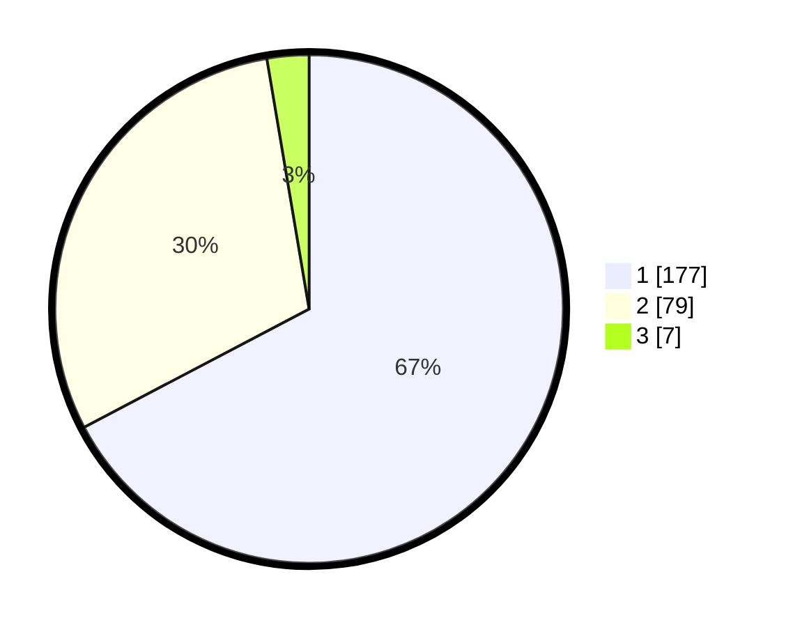

# Hasil

## Grafik

## Tabel

| No. | Nama Paslon    | Suara | Suara (raw) | Persentase |
|:--- |:-------------- | -----:| -----------:| ----------:|
| 1   | ANIES MUHAIMIN | 177   | [177][p-1]  | 67,30      |
| 2   | PRABOWO GIBRAN | 79    | [79][p-2]   | 30,04      |
| 3   | GANJAR MAHFUD  | 7     | [7][p-3]    | 2,66       |

[p-1]: https://github.com/gigit-pemilu/pemilu-2024-81-maluku/blob/main/pilpres/hitung-suara/sub/81-maluku/sub/72-kota-tual/sub/02-pulau-dullah-selatan/sub/1003-ketsoblak/sub/006-tps/sub/paslon-1.txt
[p-2]: https://github.com/gigit-pemilu/pemilu-2024-81-maluku/blob/main/pilpres/hitung-suara/sub/81-maluku/sub/72-kota-tual/sub/02-pulau-dullah-selatan/sub/1003-ketsoblak/sub/006-tps/sub/paslon-2.txt
[p-3]: https://github.com/gigit-pemilu/pemilu-2024-81-maluku/blob/main/pilpres/hitung-suara/sub/81-maluku/sub/72-kota-tual/sub/02-pulau-dullah-selatan/sub/1003-ketsoblak/sub/006-tps/sub/paslon-3.txt

## Foto C Plano

https://sirekap-obj-formc.kpu.go.id/f25f/pemilu/ppwp/81/72/02/10/03/8172021003006-20240215-170535--83bf62c9-dea6-45e6-8a54-1a33644c4036.jpg

https://sirekap-obj-formc.kpu.go.id/f25f/pemilu/ppwp/81/72/02/10/03/8172021003006-20240215-170704--3693135f-6eda-46e4-8fff-ce4fd0f59d5f.jpg

https://sirekap-obj-formc.kpu.go.id/f25f/pemilu/ppwp/81/72/02/10/03/8172021003006-20240215-170851--f36af7bf-40c8-4240-862a-4832102d3d26.jpg

## Metadata

| Key        | Value               |
| ---------- | ------------------- |
| Time Stamp | 2024-02-15 19:30:26 |

