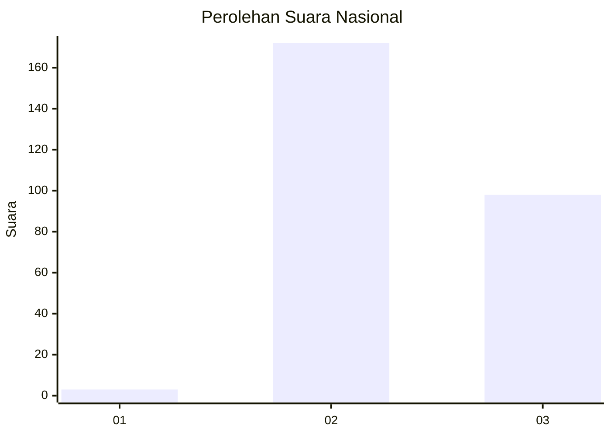
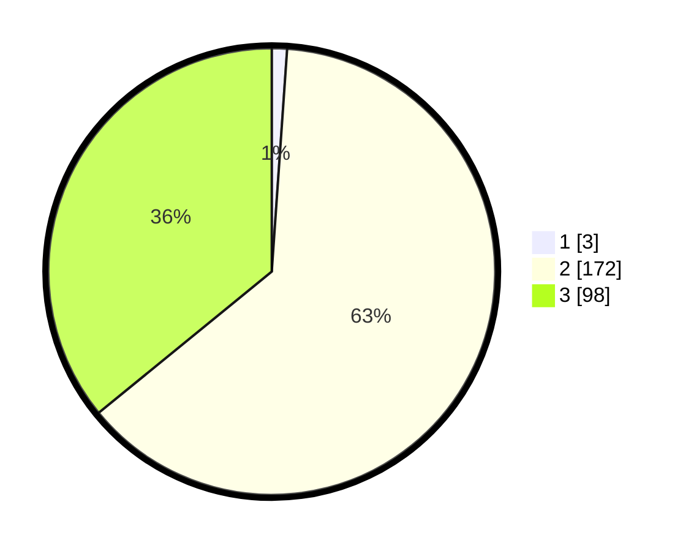

# Hasil

## Grafik

## Tabel

| No. | Nama Paslon    | Suara | Suara (raw) | Persentase |
|:--- |:-------------- | -----:| -----------:| ----------:|
| 1   | ANIES MUHAIMIN | 3     | [3][p-1]    | 1,10       |
| 2   | PRABOWO GIBRAN | 172   | [172][p-2]  | 63,00      |
| 3   | GANJAR MAHFUD  | 98    | [98][p-3]   | 35,90      |

[p-1]: https://github.com/gigit-pemilu/pemilu-2024/blob/main/pilpres/hitung-suara/sub/81-maluku/sub/72-kota-tual/sub/02-pulau-dullah-selatan/sub/1003-ketsoblak/sub/018-tps/sub/paslon-1.txt
[p-2]: https://github.com/gigit-pemilu/pemilu-2024/blob/main/pilpres/hitung-suara/sub/81-maluku/sub/72-kota-tual/sub/02-pulau-dullah-selatan/sub/1003-ketsoblak/sub/018-tps/sub/paslon-2.txt
[p-3]: https://github.com/gigit-pemilu/pemilu-2024/blob/main/pilpres/hitung-suara/sub/81-maluku/sub/72-kota-tual/sub/02-pulau-dullah-selatan/sub/1003-ketsoblak/sub/018-tps/sub/paslon-3.txt

## Foto C Plano

https://sirekap-obj-formc.kpu.go.id/afce/pemilu/ppwp/81/72/02/10/03/8172021003018-20240215-180553--ea1cc284-049d-4991-af93-34c6c9d99a17.jpg

https://sirekap-obj-formc.kpu.go.id/afce/pemilu/ppwp/81/72/02/10/03/8172021003018-20240215-180654--3ab7f615-0ff7-4984-b490-3c96a9b41685.jpg

https://sirekap-obj-formc.kpu.go.id/afce/pemilu/ppwp/81/72/02/10/03/8172021003018-20240215-180828--76b0944a-6a34-4bf8-bfe3-d090ad016804.jpg

## Metadata

| Key        | Value               |
| ---------- | ------------------- |
| Time Stamp | 2024-02-25 10:00:00 |

