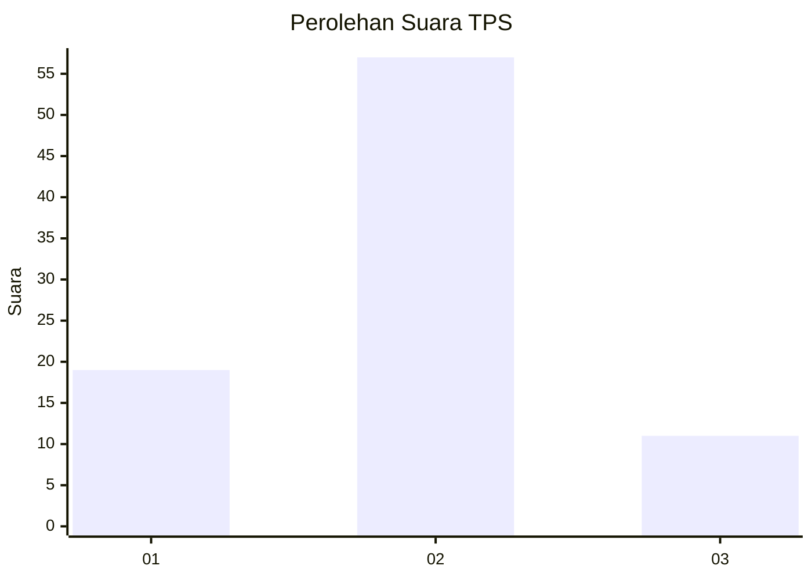
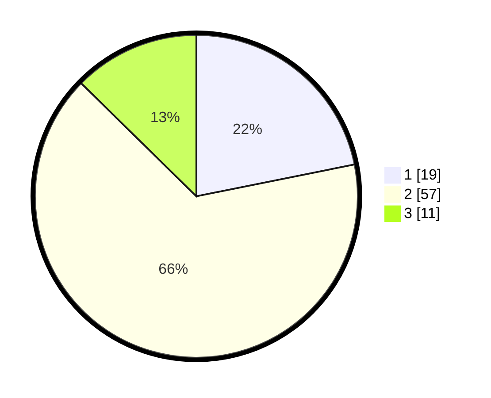

# Hasil

## Grafik

## Tabel

| No. | Nama Paslon    | Suara | Suara (raw) | Persentase |
|:--- |:-------------- | -----:| -----------:| ----------:|
| 1   | ANIES MUHAIMIN | 19    | [19][p-1]   | 21,84      |
| 2   | PRABOWO GIBRAN | 57    | [57][p-2]   | 65,52      |
| 3   | GANJAR MAHFUD  | 11    | [11][p-3]   | 12,64      |

[p-1]: https://github.com/gigit-pemilu/pemilu-2024-81-maluku/blob/main/pilpres/hitung-suara/sub/81-maluku/sub/72-kota-tual/sub/02-pulau-dullah-selatan/sub/1004-masrum/sub/016-tps/sub/paslon-1.txt
[p-2]: https://github.com/gigit-pemilu/pemilu-2024-81-maluku/blob/main/pilpres/hitung-suara/sub/81-maluku/sub/72-kota-tual/sub/02-pulau-dullah-selatan/sub/1004-masrum/sub/016-tps/sub/paslon-2.txt
[p-3]: https://github.com/gigit-pemilu/pemilu-2024-81-maluku/blob/main/pilpres/hitung-suara/sub/81-maluku/sub/72-kota-tual/sub/02-pulau-dullah-selatan/sub/1004-masrum/sub/016-tps/sub/paslon-3.txt

## Foto C Plano

https://sirekap-obj-formc.kpu.go.id/b723/pemilu/ppwp/81/72/02/10/04/8172021004016-20240214-130512--8e3de345-b14a-409f-8fbe-7d3b6c74f51c.jpg

https://sirekap-obj-formc.kpu.go.id/b723/pemilu/ppwp/81/72/02/10/04/8172021004016-20240214-130432--d2e27b44-a5f6-4a1e-9770-efca548f3d10.jpg

https://sirekap-obj-formc.kpu.go.id/b723/pemilu/ppwp/81/72/02/10/04/8172021004016-20240214-130549--70852623-1f02-4fb3-88e1-223a1cd001e6.jpg

## Metadata

| Key        | Value               |
| ---------- | ------------------- |
| Time Stamp | 2024-02-25 13:00:00 |

