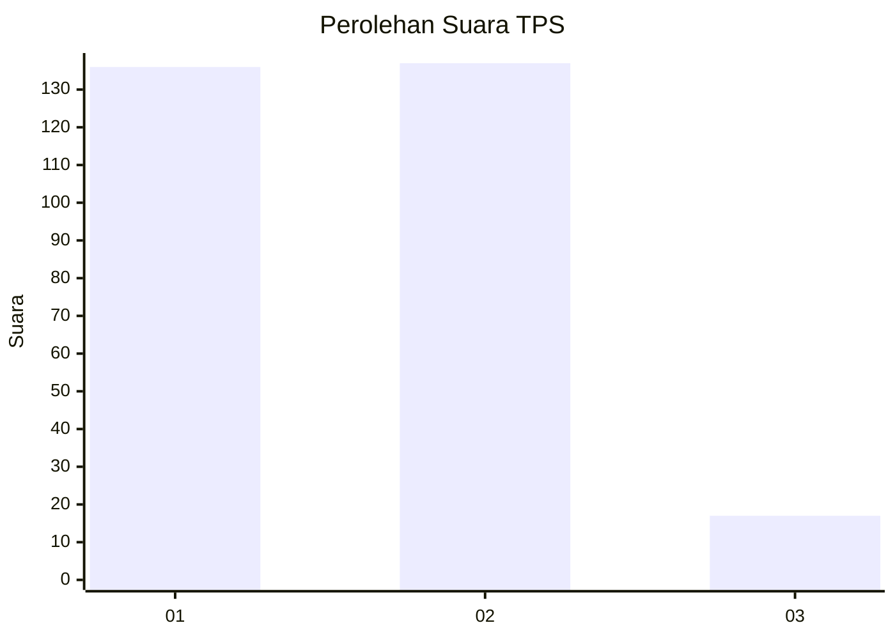
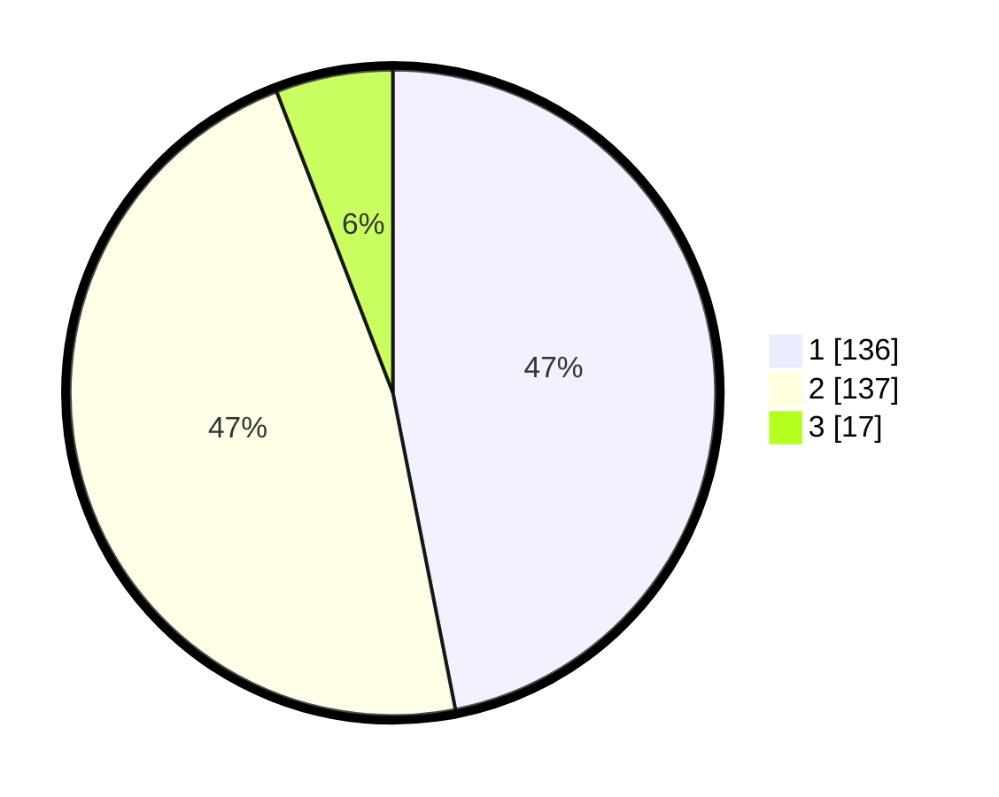

# Hasil

## Grafik

## Tabel

| No. | Nama Paslon    | Suara | Suara (raw) | Persentase |
|:--- |:-------------- | -----:| -----------:| ----------:|
| 1   | ANIES MUHAIMIN | 136   | [136][p-1]  | 46,90      |
| 2   | PRABOWO GIBRAN | 137   | [137][p-2]  | 47,24      |
| 3   | GANJAR MAHFUD  | 17    | [17][p-3]   | 5,86       |

[p-1]: https://github.com/gigit-pemilu/pemilu-2024-81-maluku/blob/main/pilpres/hitung-suara/sub/81-maluku/sub/72-kota-tual/sub/02-pulau-dullah-selatan/sub/1005-lodar-el/sub/025-tps/sub/paslon-1.txt
[p-2]: https://github.com/gigit-pemilu/pemilu-2024-81-maluku/blob/main/pilpres/hitung-suara/sub/81-maluku/sub/72-kota-tual/sub/02-pulau-dullah-selatan/sub/1005-lodar-el/sub/025-tps/sub/paslon-2.txt
[p-3]: https://github.com/gigit-pemilu/pemilu-2024-81-maluku/blob/main/pilpres/hitung-suara/sub/81-maluku/sub/72-kota-tual/sub/02-pulau-dullah-selatan/sub/1005-lodar-el/sub/025-tps/sub/paslon-3.txt

## Foto C Plano

https://sirekap-obj-formc.kpu.go.id/2eba/pemilu/ppwp/81/72/02/10/05/8172021005025-20240215-131625--b6d90dc8-ef5f-4f8c-9dee-f56b8f7a70cb.jpg

https://sirekap-obj-formc.kpu.go.id/2eba/pemilu/ppwp/81/72/02/10/05/8172021005025-20240215-131750--54e8a2bf-865b-4dac-80bd-8b7def9855ef.jpg

https://sirekap-obj-formc.kpu.go.id/2eba/pemilu/ppwp/81/72/02/10/05/8172021005025-20240215-132051--8693c725-a0b8-4b1f-93b2-0974b0706f93.jpg

## Metadata

| Key        | Value               |
| ---------- | ------------------- |
| Time Stamp | 2024-02-25 17:00:00 |

