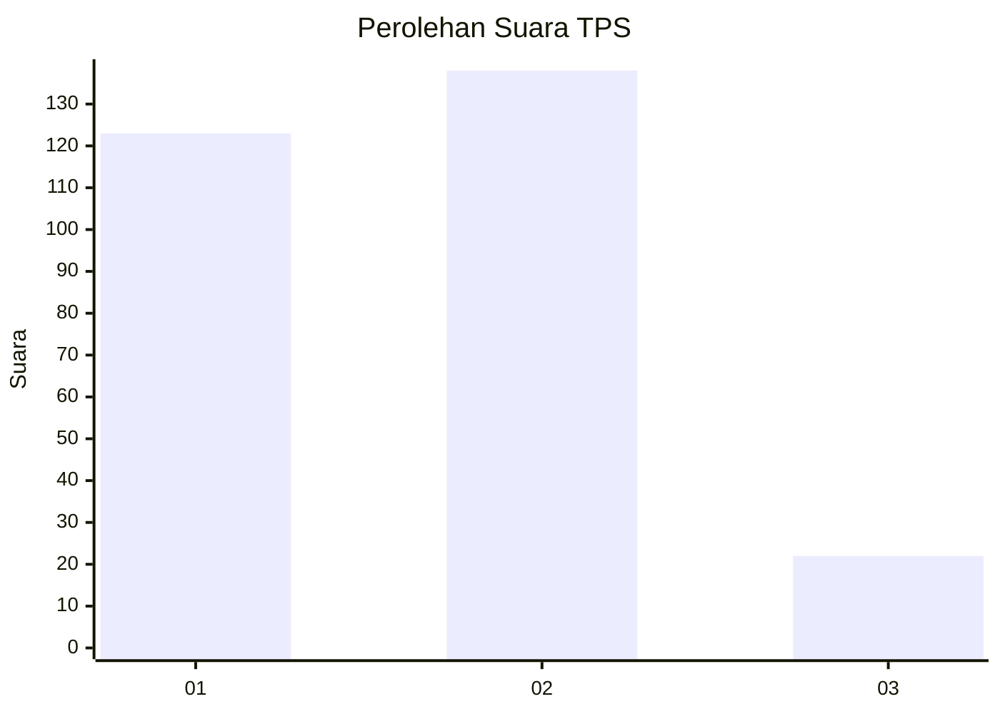
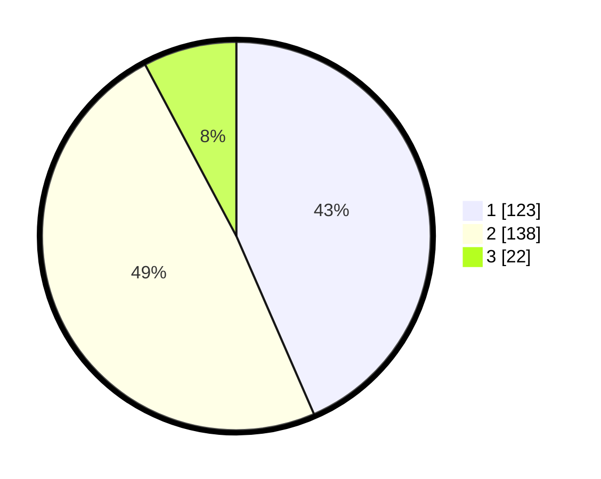

# Hasil

## Grafik

## Tabel

| No. | Nama Paslon    | Suara | Suara (raw) | Persentase |
|:--- |:-------------- | -----:| -----------:| ----------:|
| 1   | ANIES MUHAIMIN | 123   | [123][p-1]  | 43,46      |
| 2   | PRABOWO GIBRAN | 138   | [138][p-2]  | 48,76      |
| 3   | GANJAR MAHFUD  | 22    | [22][p-3]   | 7,77       |

[p-1]: https://github.com/gigit-pemilu/pemilu-2024-81-maluku/blob/main/pilpres/hitung-suara/sub/81-maluku/sub/72-kota-tual/sub/02-pulau-dullah-selatan/sub/2001-tual/sub/006-tps/sub/paslon-1.txt
[p-2]: https://github.com/gigit-pemilu/pemilu-2024-81-maluku/blob/main/pilpres/hitung-suara/sub/81-maluku/sub/72-kota-tual/sub/02-pulau-dullah-selatan/sub/2001-tual/sub/006-tps/sub/paslon-2.txt
[p-3]: https://github.com/gigit-pemilu/pemilu-2024-81-maluku/blob/main/pilpres/hitung-suara/sub/81-maluku/sub/72-kota-tual/sub/02-pulau-dullah-selatan/sub/2001-tual/sub/006-tps/sub/paslon-3.txt

## Foto C Plano

https://sirekap-obj-formc.kpu.go.id/ef88/pemilu/ppwp/81/72/02/20/01/8172022001006-20240215-133532--f1554006-1c11-40a0-8164-4bf640bd3166.jpg

https://sirekap-obj-formc.kpu.go.id/ef88/pemilu/ppwp/81/72/02/20/01/8172022001006-20240215-135709--e76fc2a3-3423-4725-b738-e06077200c57.jpg

https://sirekap-obj-formc.kpu.go.id/ef88/pemilu/ppwp/81/72/02/20/01/8172022001006-20240215-134013--e99885cb-6bcf-489c-b952-f0b3ee28aaa1.jpg

## Metadata

| Key        | Value               |
| ---------- | ------------------- |
| Time Stamp | 2024-02-15 17:30:25 |

