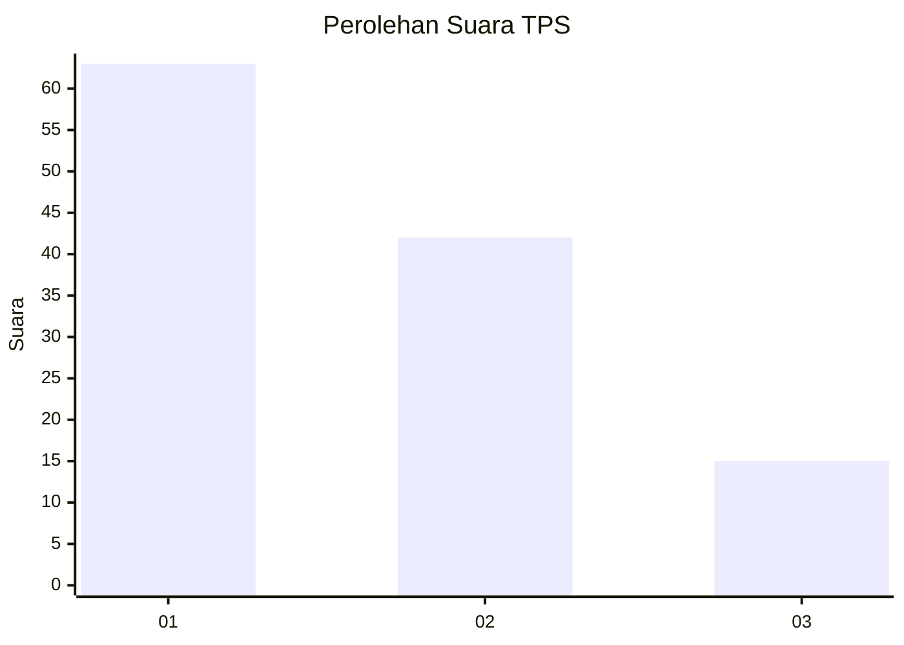
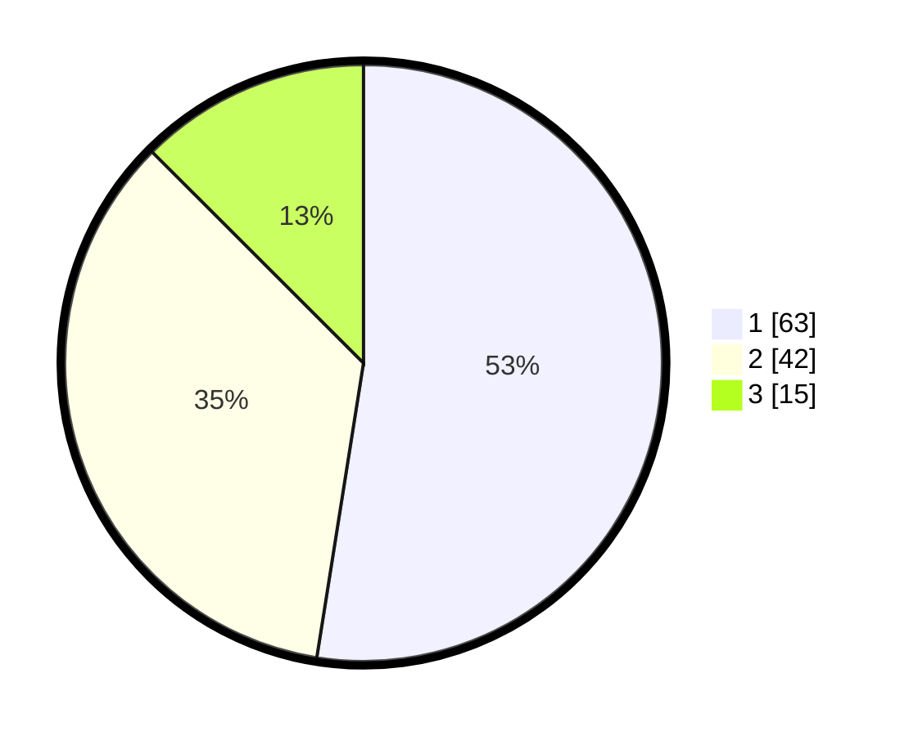

# Hasil

## Grafik

## Tabel

| No. | Nama Paslon    | Suara | Suara (raw) | Persentase |
|:--- |:-------------- | -----:| -----------:| ----------:|
| 1   | ANIES MUHAIMIN | 63    | [63][p-1]   | 52,50      |
| 2   | PRABOWO GIBRAN | 42    | [42][p-2]   | 35,00      |
| 3   | GANJAR MAHFUD  | 15    | [15][p-3]   | 12,50      |

[p-1]: https://github.com/gigit-pemilu/pemilu-2024-81-maluku/blob/main/pilpres/hitung-suara/sub/81-maluku/sub/72-kota-tual/sub/02-pulau-dullah-selatan/sub/2001-tual/sub/013-tps/sub/paslon-1.txt
[p-2]: https://github.com/gigit-pemilu/pemilu-2024-81-maluku/blob/main/pilpres/hitung-suara/sub/81-maluku/sub/72-kota-tual/sub/02-pulau-dullah-selatan/sub/2001-tual/sub/013-tps/sub/paslon-2.txt
[p-3]: https://github.com/gigit-pemilu/pemilu-2024-81-maluku/blob/main/pilpres/hitung-suara/sub/81-maluku/sub/72-kota-tual/sub/02-pulau-dullah-selatan/sub/2001-tual/sub/013-tps/sub/paslon-3.txt

## Foto C Plano

https://sirekap-obj-formc.kpu.go.id/7ff8/pemilu/ppwp/81/72/02/20/01/8172022001013-20240215-143652--606dc7a8-8517-46cd-b80d-a56c196e6a96.jpg

https://sirekap-obj-formc.kpu.go.id/7ff8/pemilu/ppwp/81/72/02/20/01/8172022001013-20240215-133132--b1954ffb-e1af-4987-a025-6a22f58030f6.jpg

https://sirekap-obj-formc.kpu.go.id/7ff8/pemilu/ppwp/81/72/02/20/01/8172022001013-20240215-143918--17f579ef-7ded-4b91-9d05-79b2c3363235.jpg

## Metadata

| Key        | Value               |
| ---------- | ------------------- |
| Time Stamp | 2024-02-24 22:31:28 |

