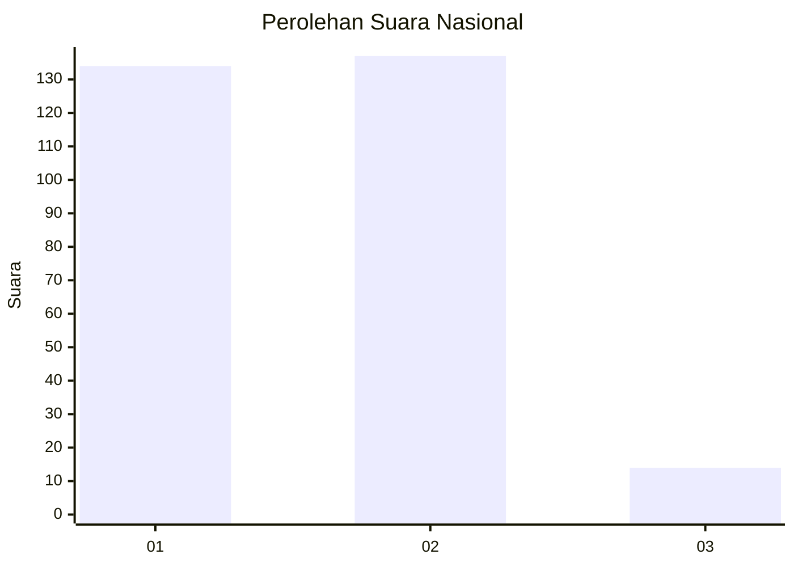
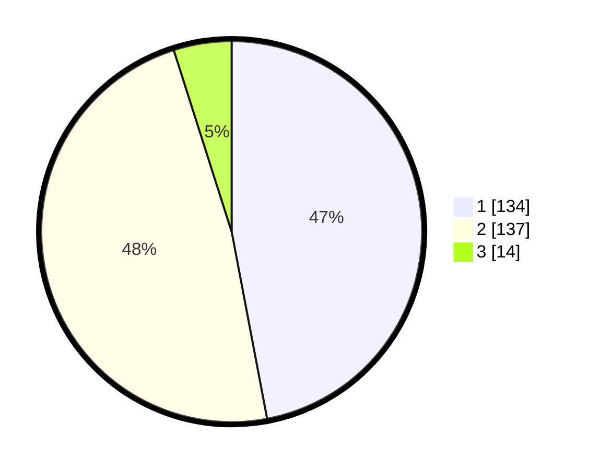

# Hasil

## Grafik

## Tabel

| No. | Nama Paslon    | Suara | Suara (raw) | Persentase |
|:--- |:-------------- | -----:| -----------:| ----------:|
| 1   | ANIES MUHAIMIN | 134   | [134][p-1]  | 47,02      |
| 2   | PRABOWO GIBRAN | 137   | [137][p-2]  | 48,07      |
| 3   | GANJAR MAHFUD  | 14    | [14][p-3]   | 4,91       |

[p-1]: https://github.com/gigit-pemilu/pemilu-2024/blob/main/pilpres/hitung-suara/sub/81-maluku/sub/72-kota-tual/sub/03-tayando-tam/sub/2001-tam-ngurhir/sub/001-tps/sub/paslon-1.txt
[p-2]: https://github.com/gigit-pemilu/pemilu-2024/blob/main/pilpres/hitung-suara/sub/81-maluku/sub/72-kota-tual/sub/03-tayando-tam/sub/2001-tam-ngurhir/sub/001-tps/sub/paslon-2.txt
[p-3]: https://github.com/gigit-pemilu/pemilu-2024/blob/main/pilpres/hitung-suara/sub/81-maluku/sub/72-kota-tual/sub/03-tayando-tam/sub/2001-tam-ngurhir/sub/001-tps/sub/paslon-3.txt

## Foto C Plano

https://sirekap-obj-formc.kpu.go.id/c0a3/pemilu/ppwp/81/72/03/20/01/8172032001001-20240217-204202--52bb8c16-39fc-444e-8e3f-e0bd99410c34.jpg

https://sirekap-obj-formc.kpu.go.id/c0a3/pemilu/ppwp/81/72/03/20/01/8172032001001-20240217-204203--b55f7cc6-f914-4607-96b8-9fce43ee442c.jpg

https://sirekap-obj-formc.kpu.go.id/c0a3/pemilu/ppwp/81/72/03/20/01/8172032001001-20240217-204202--71094c2c-3f47-4886-8c9b-401f7eb93d3c.jpg

## Metadata

| Key        | Value               |
| ---------- | ------------------- |
| Time Stamp | 2024-02-21 18:00:00 |

## DATA PEMILIH TETAP

Jumlah pemilih dalam DPT: **283**.
 * L: **127**.
 * P: **156**.

## DATA PENGGUNA HAK PILIH

Jumlah pengguna hak pilih dalam DPT: **270**.
 * L: **117**.
 * P: **153**.

Jumlah pengguna hak pilih dalam DPTb: **1**.
 * L: **1**.
 * P: **0**.

Jumlah pengguna hak pilih dalam DPK: **14**.
 * L: **8**.
 * P: **6**.

Jumlah pengguna hak pilih: **285**.
 * L: **126**.
 * P: **159**.

## JUMLAH SUARA SAH DAN TIDAK SAH

JUMLAH SELURUH SUARA SAH: **285**.

JUMLAH SUARA TIDAK SAH: **0**.

JUMLAH SELURUH SUARA SAH DAN SUARA TIDAK SAH: **285**.

