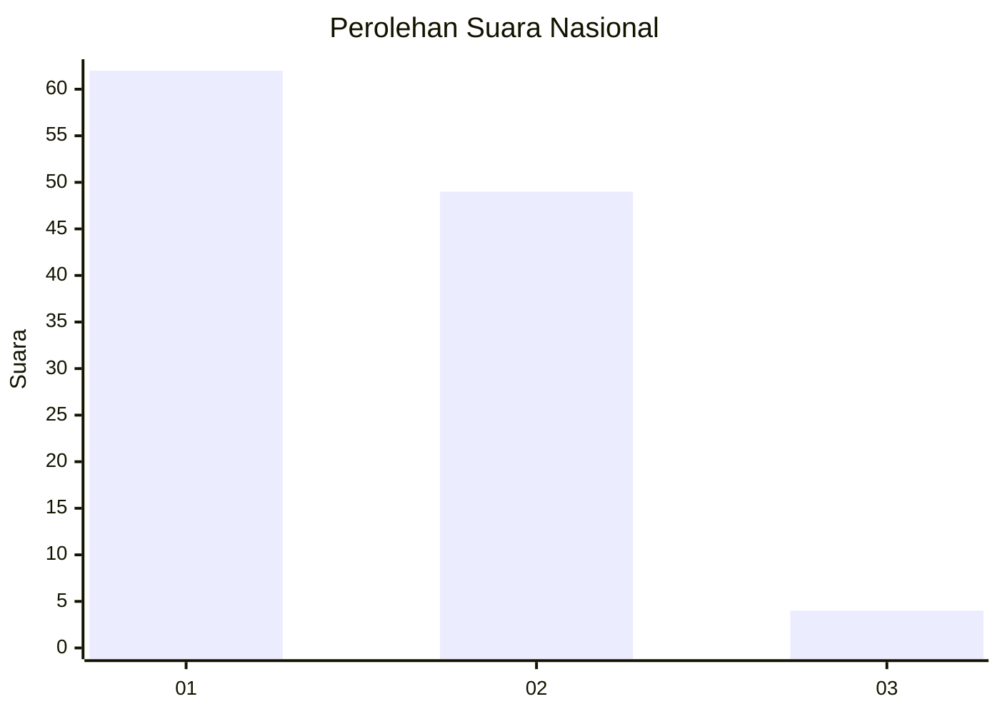
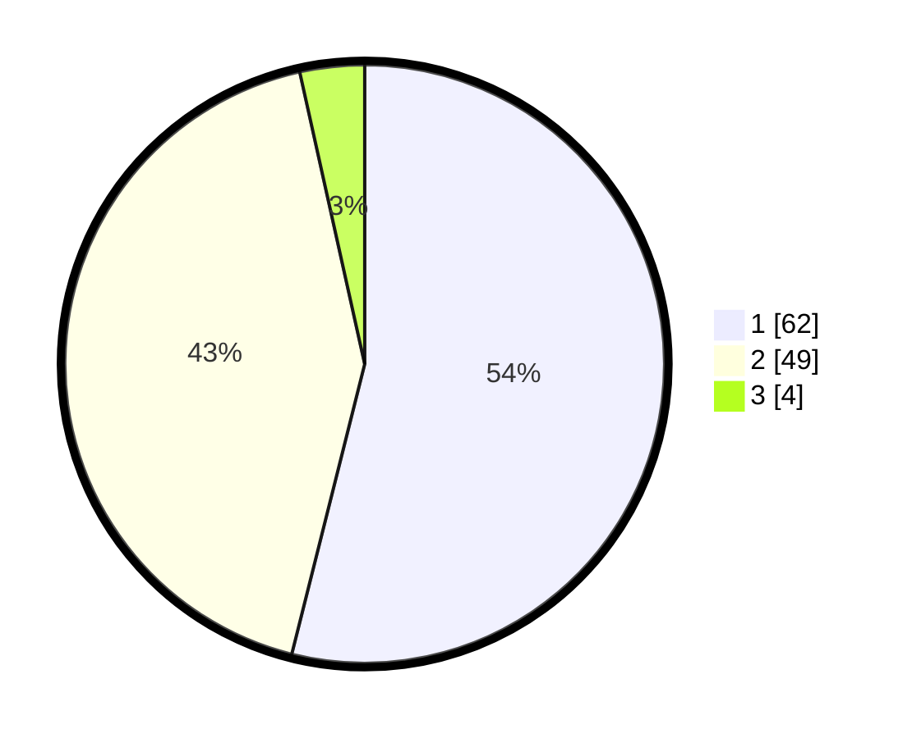

# Hasil

## Grafik

## Tabel

| No. | Nama Paslon    | Suara | Suara (raw) | Persentase |
|:--- |:-------------- | -----:| -----------:| ----------:|
| 1   | ANIES MUHAIMIN | 62    | [62][p-1]   | 53,91      |
| 2   | PRABOWO GIBRAN | 49    | [49][p-2]   | 42,61      |
| 3   | GANJAR MAHFUD  | 4     | [4][p-3]    | 3,48       |

[p-1]: https://github.com/gigit-pemilu/pemilu-2024/blob/main/pilpres/hitung-suara/sub/81-maluku/sub/72-kota-tual/sub/05-kur-selatan/sub/2007-niela/sub/001-tps/sub/paslon-1.txt
[p-2]: https://github.com/gigit-pemilu/pemilu-2024/blob/main/pilpres/hitung-suara/sub/81-maluku/sub/72-kota-tual/sub/05-kur-selatan/sub/2007-niela/sub/001-tps/sub/paslon-2.txt
[p-3]: https://github.com/gigit-pemilu/pemilu-2024/blob/main/pilpres/hitung-suara/sub/81-maluku/sub/72-kota-tual/sub/05-kur-selatan/sub/2007-niela/sub/001-tps/sub/paslon-3.txt

## Foto C Plano

https://sirekap-obj-formc.kpu.go.id/5410/pemilu/ppwp/81/72/05/20/07/8172052007001-20240215-200233--c1bf6263-b1bc-4e20-9268-ea47f74cfb46.jpg

https://sirekap-obj-formc.kpu.go.id/5410/pemilu/ppwp/81/72/05/20/07/8172052007001-20240216-080955--65b14292-7576-4b6d-93d0-9178beea2660.jpg

https://sirekap-obj-formc.kpu.go.id/5410/pemilu/ppwp/81/72/05/20/07/8172052007001-20240215-200258--a703e2cd-9dd8-4a43-802e-21da6d4fc7ca.jpg

## Metadata

| Key        | Value               |
| ---------- | ------------------- |
| Time Stamp | 2024-02-21 22:00:00 |

## DATA PEMILIH TETAP

Jumlah pemilih dalam DPT: **152**.
 * L: **850**.
 * P: **872**.

## DATA PENGGUNA HAK PILIH

Jumlah pengguna hak pilih dalam DPT: **107**.
 * L: **852**.
 * P: **850**.

Jumlah pengguna hak pilih dalam DPTb: **0**.
 * L: **888**.
 * P: **800**.

Jumlah pengguna hak pilih dalam DPK: **813**.
 * L: **84**.
 * P: **884**.

Jumlah pengguna hak pilih: **815**.
 * L: **58**.
 * P: **59**.

## JUMLAH SUARA SAH DAN TIDAK SAH

JUMLAH SELURUH SUARA SAH: **115**.

JUMLAH SUARA TIDAK SAH: **0**.

JUMLAH SELURUH SUARA SAH DAN SUARA TIDAK SAH: **115**.

